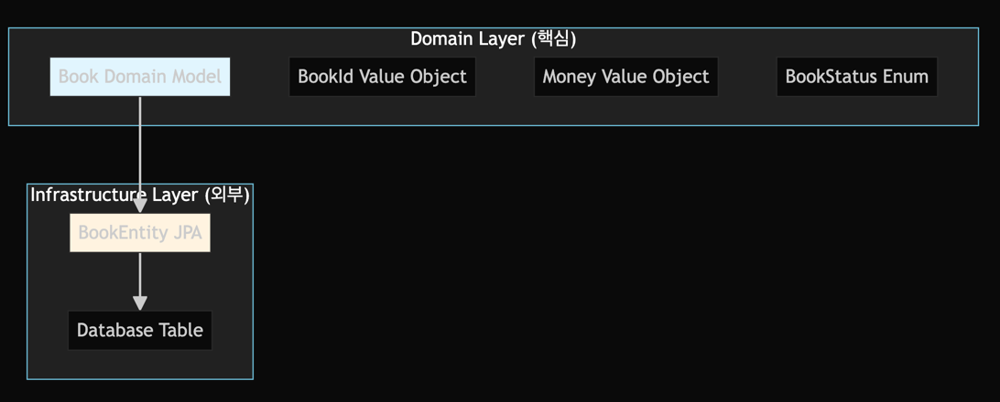

# Hexagonal Architecture

## Structure

```text
├── domain/           # 도메인 계층 (핵심 비즈니스 로직)
│   ├── model/        # 도메인 모델
│   ├── service/      # 도메인 서비스
│   └── port/         # 포트 (인터페이스)
├── application/      # 애플리케이션 계층 (유스케이스)
│   └── service/      # 애플리케이션 서비스
├── adapter/          # 어댑터 계층
│   ├── inbound/      # 인바운드 어댑터 (컨트롤러)
│   └── outbound/     # 아웃바운드 어댑터 (리포지토리 구현체)
└── config/           # 설정
```

## Summary

- 도메인 계층 (Domain Layer)
    - 비즈니스 로직의 핵심
    - 외부 의존성이 없는 순수한 코드
    - Book, BookId, Money 등의 도메인 모델
- 포트 (Ports)
    - 인바운드 포트: 외부에서 도메인을 호출하는 인터페이스 (BookService)
    - 아웃바운드 포트: 도메인이 외부를 호출하는 인터페이스 (BookRepository)
- 어댑터 (Adapters)
    - 인바운드 어댑터: 외부 요청을 도메인으로 변환 (BookController)
    - 아웃바운드 어댑터: 도메인 요청을 외부 시스템으로 변환 (BookRepositoryAdapter)
- 의존성 방향
    - 모든 의존성이 도메인을 향하고, 도메인은 외부에 의존하지 않습니다.

```text
Controller → ApplicationService → Domain ← RepositoryAdapter
```

## Adapter, In,Out 의 기준

### 도메인(Domain)을 중심으로 생각

- 모든 기준은 도메인
- Inbound (인바운드) = 외부 → 도메인 (들어오는 것 - 외부에서 도메인으로)
    - 의미: 외부에서 들어와서 도메인을 호출
    - 예시:
        - HTTP 요청 → 도메인 비즈니스 로직 호출
        - 사용자 클릭 → 도메인 서비스 실행
        - 메시지 큐 → 도메인 이벤트 처리
- Outbound (아웃바운드) = 도메인 → 외부 (나가는 것 - 도메인에서 외부로)
    - 의미: 도메인에서 나가서 외부를 호출
    - 예시:
        - 도메인 → 데이터베이스 저장
        - 도메인 → 외부 API 호출
        - 도메인 → 이메일 발송

## Domain 과 Entity 의 차이

### 목적과 책임

**도메인**

```kotlin
data class Book(
    val id: BookId,
    val title: String,
    val author: String,
    val isbn: String,
    val price: Money,  // 값 객체 사용
    val status: BookStatus,
    val createdAt: LocalDateTime,
    val updatedAt: LocalDateTime
) {
    // 비즈니스 로직 포함
    fun canBeBorrowed(): Boolean = status == BookStatus.AVAILABLE

    fun borrow(): Book {
        require(canBeBorrowed()) { "대출 가능한 도서가 아닙니다." }
        return copy(status = BookStatus.BORROWED, updatedAt = LocalDateTime.now())
    }

    fun returnBook(): Book {
        require(status == BookStatus.BORROWED) { "대출 중인 도서가 아닙니다." }
        return copy(status = BookStatus.AVAILABLE, updatedAt = LocalDateTime.now())
    }
}
```

**Entity**

```kotlin
@Entity
@Table(name = "books")
class BookEntity(
    @Id
    @GeneratedValue(strategy = GenerationType.IDENTITY)
    val id: Long = 0,

    @Column(nullable = false)
    val title: String,

    @Column(nullable = false, precision = 10, scale = 2)
    val price: BigDecimal,  // 원시 타입 사용

    // 🎯 데이터베이스 매핑만 담당
    // 비즈니스 로직 없음
) {
    // 변환 메서드만 존재
    fun toDomain(): Book {
        ...
    }
    fun from(book: Book): BookEntity {
        ...
    }
}
```


### Location within the Architecture



### Summary


### Point

Domain Model:

- "무엇을 할 수 있는가?" (비즈니스 능력)
  Entity:
- "어떻게 저장되는가?" (데이터 구조)
  같은 필드를 가져도 다른 목적:
- Domain: 비즈니스 규칙과 로직
- Entity: 데이터베이스 매핑과 저장
  분리 이유:
- 도메인 로직이 인프라스트럭처에 의존하지 않도록 하기 위함.

**이렇게 목적이 다르기 때문에 같은 필드를 가져도 별도로 존재**