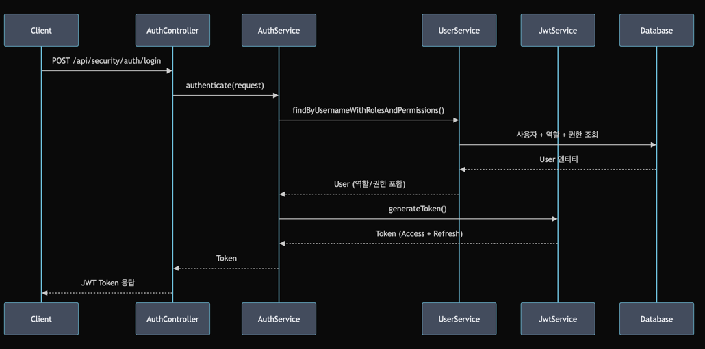
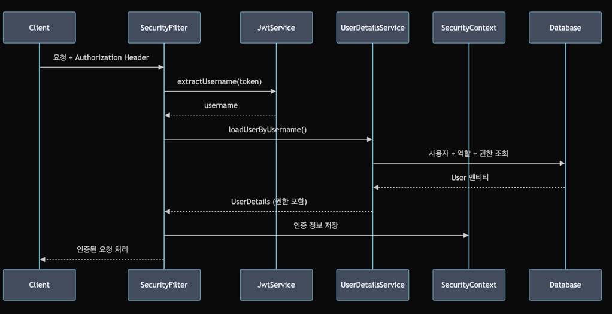
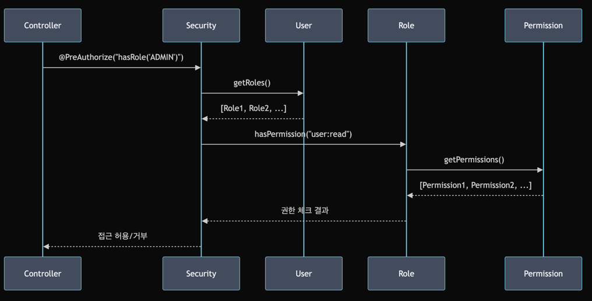

# Security Module

RBAC(Role-Based Access Control), JWT, Keycloak을 중심으로 한 확장 가능한 보안 모듈

## 주요 기능

### RBAC (Role-Based Access Control)

- 사용자(User), 역할(Role), 권한(Permission) 기반 접근 제어
- 역할과 권한의 계층적 구조 지원
- 사용자별 직접 권한 할당 지원

### 2. JWT (JSON Web Token)

- Access Token과 Refresh Token 지원
- 토큰 생성, 검증, 갱신 기능
- 사용자 정보 및 권한 정보 포함

### 3. Keycloak 연동

- Keycloak을 통한 사용자 인증
- 로컬 DB와 Keycloak 사용자 동기화
- OAuth2/OIDC 프로토콜 지원

### 4. 확장성

- ABAC, PBAC 확장을 위한 정책 인터페이스 제공
- 플러그인 방식의 접근 정책 구현

## 아키텍처

```text
Security Module
├── Domain Layer (도메인 레이어)
│ ├── common/ - 공통 도메인 모델 (BaseEntity, ValueObject)
│ ├── rbac/ - RBAC 도메인 모델 (User, Role, Permission)
│ ├── jwt/ - JWT 도메인 모델 (Token, TokenRequest)
│ └── policy/ - 정책 인터페이스 (AccessPolicy)
├── Application Layer (애플리케이션 레이어)
│ └── service/ - 비즈니스 로직 서비스
├── Infrastructure Layer (인프라 레이어)
│ ├── config/ - 설정 (Security, DataInitializer)
│ ├── repository/ - 데이터 접근 (JPA Repository)
│ ├── service/ - 인프라 서비스 (UserDetailsService)
│ └── filter/ - 보안 필터 (JWT Filter)
└── Controller Layer (프레젠테이션 레이어)
└── REST API 컨트롤러들
```

## 핵심 도메인 모델

- RBAC 모델
    - User: 사용자 (username, email, password, keycloakId)
    - Role: 역할 (name, description) - ADMIN, USER, MANAGER
    - Permission: 권한 (name, resource, action) - user:read, user:write 등
    - 연관관계: User ↔ Role ↔ Permission (다대다)
- JWT 모델
    - Token: AccessToken + RefreshToken + 사용자 정보
    - TokenRequest: 로그인 요청 (username, password)
    - TokenValidationResult: 토큰 검증 결과

## 주요 인증 플로우



## 주요 인가 플로우



## RBAC 권한 체크 플로우



## 구현된 주요 기능들:

- **도메인 모델**
    - User, Role, Permission, Token 등
- **리포지토리**
    - JPA 기반 데이터 접근
- **서비스**
    - 비즈니스 로직 구현
- **보안 설정**
    - Spring Security + JWT + Keycloak
- **REST API**
    - 인증, 사용자/역할/권한 관리
- **테스트**:
    - Kotest, MockK, Fixture Monkey 사용
- **초기 데이터**
    - 기본 역할, 권한, 사용자 설정
- **확장성**
    - ABAC, PBAC를 위한 정책 인터페이스

## API 엔드포인트

### 인증

- `POST /api/security/auth/login` - 로그인
- `POST /api/security/auth/refresh` - 토큰 갱신
- `POST /api/security/auth/validate` - 토큰 검증

### 사용자 관리

- `POST /api/security/users` - 사용자 생성
- `GET /api/security/users/{username}` - 사용자 조회
- `POST /api/security/users/{username}/roles/{roleName}` - 역할 할당
- `DELETE /api/security/users/{username}/roles/{roleName}` - 역할 제거

### 역할 관리

- `POST /api/security/roles` - 역할 생성
- `GET /api/security/roles` - 역할 목록 조회
- `GET /api/security/roles/{name}` - 역할 조회
- `POST /api/security/roles/{roleName}/permissions/{permissionName}` - 권한 할당

### 권한 관리

- `POST /api/security/permissions` - 권한 생성
- `GET /api/security/permissions` - 권한 목록 조회
- `GET /api/security/permissions/{name}` - 권한 조회
-

### 인증

- `POST /api/security/auth/login` - 로그인
- `POST /api/security/auth/refresh` - 토큰 갱신
- `POST /api/security/auth/validate` - 토큰 검증

### 사용자 관리

- `POST /api/security/users` - 사용자 생성
- `GET /api/security/users/{username}` - 사용자 조회
- `POST /api/security/users/{username}/roles/{roleName}` - 역할 할당
- `DELETE /api/security/users/{username}/roles/{roleName}` - 역할 제거

### 역할 관리

- `POST /api/security/roles` - 역할 생성
- `GET /api/security/roles` - 역할 목록 조회
- `GET /api/security/roles/{name}` - 역할 조회
- `POST /api/security/roles/{roleName}/permissions/{permissionName}` - 권한 할당

### 권한 관리

- `POST /api/security/permissions` - 권한 생성
- `GET /api/security/permissions` - 권한 목록 조회
- `GET /api/security/permissions/{name}` - 권한 조회

## 설정

### application.yml

```yaml
# JWT 설정
jwt:
  secret: your-secret-key
  expiration: 86400000
  refresh-expiration: 604800000

# Keycloak 설정
keycloak:
  server-url: http://localhost:8080
  realm: your-realm
  client-id: your-client-id
  client-secret: your-client-secret
```

## 초기 데이터

애플리케이션 시작 시 다음 데이터가 자동으로 생성

### 기본 역할

- `ADMIN`: 시스템 관리자
- `USER`: 일반 사용자
- `MANAGER`: 매니저

### 기본 권한

- `user:read`, `user:write`, `user:delete`
- `role:read`, `role:write`, `role:delete`
- `permission:read`, `permission:write`, `permission:delete`
- `profile:read`, `profile:write`

### 기본 사용자

- `admin` / `admin123` (ADMIN 역할)
- `user1` / `user123` (USER 역할)
- `manager1` / `manager123` (MANAGER 역할)

## 테스트

```bash
./gradlew test
```

## 확장 가이드

### ABAC 구현

1. `AccessPolicy` 인터페이스 구현
2. 속성 기반 접근 제어 로직 작성
3. `AccessContext`에 필요한 속성 추가

### PBAC 구현

1. `AccessPolicy` 인터페이스 구현
2. 정책 엔진 연동
3. 동적 정책 평가 로직 구현

## 보안 고려사항

- **JWT Secret**
    - 프로덕션에서는 충분히 긴 랜덤 키 사용
- **토큰 만료**
    - 적절한 만료 시간 설정
- **HTTPS**
    - 프로덕션에서는 반드시 HTTPS 사용
- **CORS**
    - 필요한 도메인만 허용
- **Keycloak**
    - 프로덕션 환경에서는 별도 서버 운영 권장

## 분석 시나리오

### 단계별 파악

#### 1단계: 전체 아키텍처 파악

- README.md - 전체 개요와 구조 설명
- build.gradle.kts - 사용된 기술 스택과 의존성 파악
- application.yml - 설정 정보 확인

#### 2단계: 도메인 모델 이해

도메인 레이어부터 시작

```text
security/src/main/kotlin/rounderall/security/domain/
├── common/
│   ├── BaseEntity.kt          ← 1. 기본 엔티티 구조
│   └── ValueObject.kt         ← 2. 값 객체 패턴
├── rbac/
│   ├── User.kt                ← 3. 사용자 도메인 (핵심)
│   ├── Role.kt                ← 4. 역할 도메인
│   ├── Permission.kt          ← 5. 권한 도메인
│   ├── UserRole.kt            ← 6. 사용자-역할 관계
│   ├── RolePermission.kt      ← 7. 역할-권한 관계
│   └── UserPermission.kt      ← 8. 사용자-권한 관계
├── jwt/
│   └── Token.kt               ← 9. JWT 토큰 도메인
└── policy/
    ├── AccessPolicy.kt        ← 10. 접근 정책 인터페이스
    └── RbacPolicy.kt          ← 11. RBAC 정책 구현
```

#### 3단계: 인프라 레이어 파악

데이터 접근과 설정

```text
security/src/main/kotlin/rounderall/security/infrastructure/
├── repository/
│   ├── UserRepository.kt      ← 12. 사용자 데이터 접근
│   ├── RoleRepository.kt      ← 13. 역할 데이터 접근
│   └── PermissionRepository.kt ← 14. 권한 데이터 접근
├── config/
│   ├── SecurityConfig.kt      ← 15. Spring Security 설정
│   └── DataInitializer.kt     ← 16. 초기 데이터 설정
├── service/
│   └── CustomUserDetailsService.kt ← 17. 사용자 인증 서비스
└── filter/
    └── JwtAuthenticationFilter.kt  ← 18. JWT 인증 필터
```

#### 4단계: 애플리케이션 레이어 이해

비즈니스 로직

```text
security/src/main/kotlin/rounderall/security/application/service/
├── AuthenticationService.kt   ← 19. 인증 서비스 (핵심)
├── JwtService.kt              ← 20. JWT 토큰 서비스
├── UserService.kt             ← 21. 사용자 관리 서비스
├── RoleService.kt             ← 22. 역할 관리 서비스
├── PermissionService.kt       ← 23. 권한 관리 서비스
└── KeycloakService.kt         ← 24. Keycloak 연동 서비스
```

#### 5단계: 프레젠테이션 레이어 확인

REST API

```text
security/src/main/kotlin/rounderall/security/controller/
├── AuthController.kt          ← 25. 인증 API
├── UserController.kt          ← 26. 사용자 관리 API
├── RoleController.kt          ← 27. 역할 관리 API
└── PermissionController.kt    ← 28. 권한 관리 API
```

### 핵심 플로우 이해

- 인증 플로우
    - `AuthController.login()` → `AuthenticationService.authenticate()`
    - `JwtService.generateToken()` → 토큰 생성
    - `JwtAuthenticationFilter` → 요청마다 토큰 검증
- 권한 확인 플로우
    - `User.hasPermission()` → 사용자 권한 확인
    - `RbacPolicy.evaluate()` → RBAC 정책 적용
    - `@PreAuthorize` → 메서드 레벨 보안

### 분석 접근 방식

- Top-Down 접근: 컨트롤러 → 서비스 → 도메인 순서로
- Bottom-Up 접근: 도메인 → 서비스 → 컨트롤러 순서로
- 플로우 중심: 특정 기능(로그인, 권한 확인)의 전체 흐름 추적

### 분석 실습

- 로그인 플로우를 `AuthController`부터 시작해서 끝까지 추적
- 사용자 생성 플로우를 `UserController`부터 추적
- 권한 확인 플로우를 `@PreAuthorize` 부터 추적
